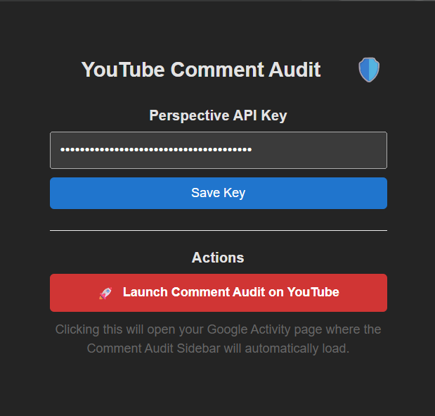
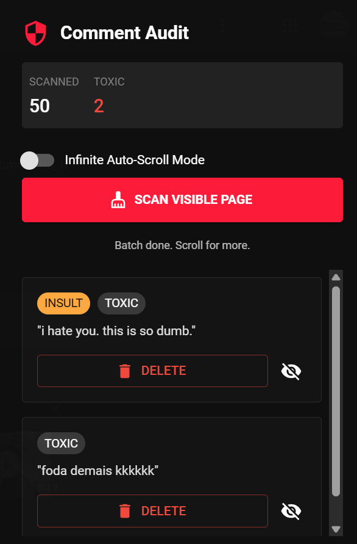

# YouTube Comment Audit  
**AI-Powered YouTube Comment Moderation & Cleanup Tool**

YouTube Comment Audit is a **client-side Chrome extension** that helps users review and clean up potentially offensive or regrettable YouTube comments from their Google activity history using **semantic analysis powered by Google’s Perspective API**.

Unlike YouTube’s bulk deletion tools, this extension emphasizes **user control and transparency**: comments are **flagged for review**, never automatically deleted.

---

## Why This Exists

Many users want to:

- Review old comments they no longer stand behind
- Improve their online footprint without deleting everything
- Avoid time-consuming manual review of years of comments
- Understand how modern AI models interpret toxicity and intent
- Reflect on how they present themselves online and make informed changes

As of **December 13, 2025**, Google provides powerful moderation models but **no end-user tooling** that integrates them into personal activity review.  
This project bridges that gap.

---

## Key Features

### Semantic Comment Analysis
- Uses **Google Perspective API** (Transformer-based NLP models)
- Detects toxicity, insults, threats, and abusive language
- Employs custom heuristics
- Goes beyond simple keyword matching with contextual AI analysis

### User-Controlled Review
- Comments are **flagged, never auto-deleted**
- Users confirm deletions **individually**
- Clear visibility into **why** a comment was flagged (model scores)

### UI Overlay
- React-based dashboard injected into `myactivity.google.com`
- Designed to survive obfuscated class names and minor UI changes
- Uses custom DOM scraping heuristics
- Respects native browser themes for accessibility and customization

### Privacy-First Design
- Users supply **their own API key**
- API key is stored **locally in the browser**
- No analytics, tracking, or third-party servers
- No data persistence beyond Google’s API processing

---

## Ethics & Responsible Use

- Analyzes **only publicly visible comments**
- No background automation or silent actions
- No scraping beyond the active page
- No credential interception
- Designed for research, moderation awareness, and UX design

---

## Tech Stack

- **Core:** React 18, Vite, Chrome Manifest V3
- **Analysis:** Google Perspective API (TensorFlow-based models)
- **DOM Handling:** Custom scraping heuristics for dynamic React UIs

---

## Screenshots

### Extension Dashboard


### Flagged Comments Review


### Comment Analysis Details


---

## Installation & Usage

### Prerequisites
- Google Chrome
- Node.js (LTS recommended)
- A Google Cloud account with billing enabled

### 1. Get a Perspective API Key
- Create a project in the **Google Cloud Console**:  
  https://console.cloud.google.com/
- As of **12/13/2025**, access requires a developer application:  
  https://support.perspectiveapi.com/s/request-api-access?language=en_US
- Enable billing for the project

---

### 2. Clone the Repository
```bash
git clone https://github.com/your-username/youtube-comment-audit
cd youtube-comment-audit
```

### 3. Install Dependencies and Build
``` bash
npm install
npm run build
```

### 4. Load the Extension in Chrome
(1) Open Chrome and navigate to chrome://extensions
(2) Enable Developer Mode (top right)
(3) Click Load unpacked
(4) Select the dist/ directory from this project

### 5. Run an Audit
(1) Open the extension
(2) Paste your Perspective API key
(3) Go to YouTube Activity page (myactivity.google.com)
(4) Review flagged comments and confirm deletions as desired!

---
## License
MIT
