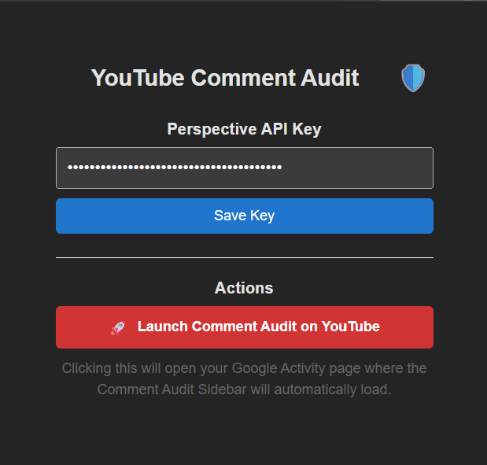
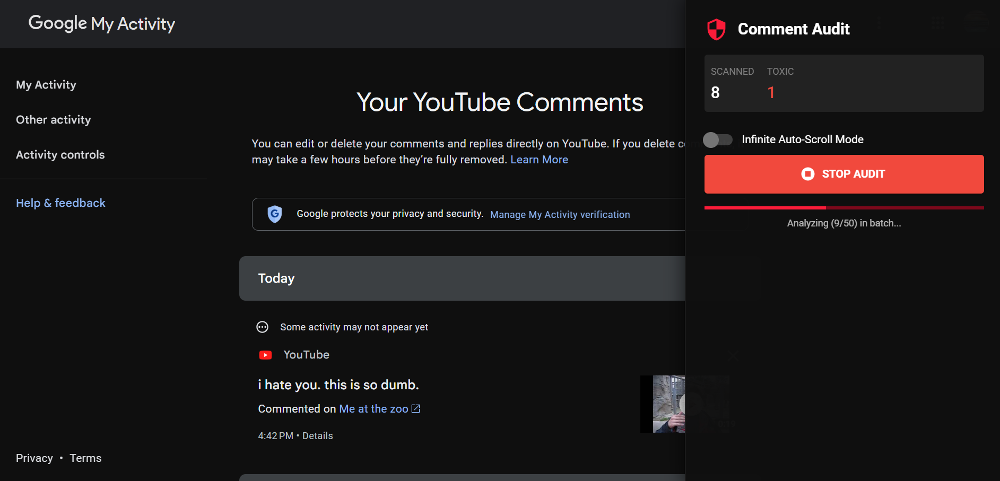
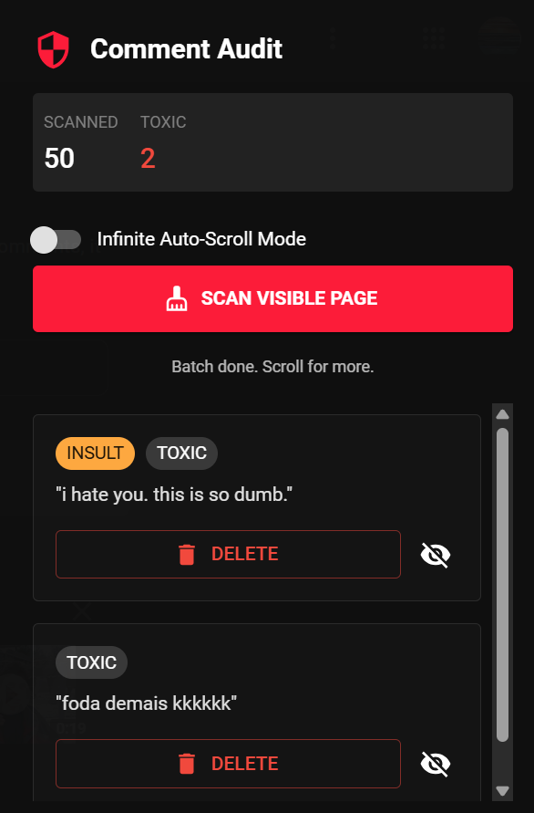

# 🧹 YouTube Comment Audit


**An AI-Powered YouTube Comment Moderation & Cleanup Tool**

YouTube Comment Audit is a client-side Chrome extension that empowers users to review and clean up potentially offensive or regrettable YouTube comments from their Google Activity history using semantic analysis powered by **Google’s Perspective API**.

Unlike native bulk-deletion tools, this extension emphasizes **user control and transparency**: comments are flagged for review based on contextual AI scoring, but are *never* automatically deleted.

## 🚀 Why This Exists

As our digital footprints grow, many users want to:
* Review old comments they no longer stand behind.
* Improve their online footprint without wiping their entire history.
* Avoid the time-consuming manual review of years of fragmented activity logs.
* Understand how modern NLP models interpret toxicity, threats, and intent.

While Google provides powerful moderation models for enterprise platforms, there is a distinct lack of end-user tooling that integrates these models into personal activity review. This project bridges that gap.

## ✨ Key Features

* **Semantic Comment Analysis:** Integrates Google's Transformer-based Perspective API to detect toxicity, severe insults, and abusive language, going far beyond simple keyword matching.
* **User-Controlled Review:** Comments are flagged with specific model scores. Users must confirm deletions individually, ensuring complete control over their data.
* **Resilient UI Overlay:** A React-based dashboard injected directly into `myactivity.google.com`, designed to survive obfuscated class names and respect native browser themes for accessibility.
* **Privacy-First Architecture:** Users supply their own API key, which is stored locally in the browser via Chrome Storage. There are no analytics, no tracking, and no third-party databases.

---

## 📸 Interface

### Extension Dashboard & Scanning



### Flagged Comment Review


---

## 🛠️ Tech Stack & Architecture

* **Core Framework:** React 19, Vite
* **Environment:** Chrome Extension Manifest V3
* **UI Components:** Material UI (MUI), Emotion
* **AI Engine:** Google Perspective API (TensorFlow-based NLP models)
* **DOM Handling:** Custom scraping heuristics for dynamic React UIs

### ⚠️ Known Limitations & Architectural Notes
* **DOM Fragility:** Because this extension relies on injecting into and scraping `myactivity.google.com`, minor UI updates from Google may temporarily break comment detection. 
* **Fail-Safe Design:** If the Perspective API rate-limits the user or encounters a network error, the analyzer is designed to explicitly throw errors rather than silently passing toxic comments as "safe."

---

## ⚖️ Ethics & Responsible Use

This tool was built with strict ethical boundaries regarding automation and moderation:
- It analyzes **only publicly visible comments** belonging to the authenticated user.
- **No background automation:** The tool only runs when explicitly triggered on the active page.
- **No credential interception:** It relies entirely on the user's existing Google session.
- Designed strictly for personal moderation awareness, research, and UI/UX design exploration.

---

## ⚙️ Installation & Usage

### Prerequisites
- Google Chrome
- Node.js (LTS recommended)
- A Google Cloud account with billing enabled to access the Perspective API.

### 1. Get a Perspective API Key
1. Create a project in the [Google Cloud Console](https://console.cloud.google.com/).
2. *Note: Access currently requires submitting a developer application via the [Perspective API portal](https://support.perspectiveapi.com/s/request-api-access).*
3. Enable billing for the project and generate an API key.

### 2. Build the Extension
```bash
git clone [https://github.com/your-username/youtube-comment-audit](https://github.com/your-username/youtube-comment-audit)
cd youtube-comment-audit
npm install
npm run build
```

### 3. Load in Chrome
1. Open Chrome and navigate to `chrome://extensions`.
2. Enable **Developer Mode** (top right toggle).
3. Click **Load unpacked**.
4. Select the `dist/` directory generated by the build step.

### 4. Run an Audit
1. Open the extension popup and paste your Perspective API key.
2. Navigate to your [YouTube Activity page](https://myactivity.google.com/product/youtube_comments).
3. Start the scan and review your flagged comments!

---

## 📄 License
MIT License
